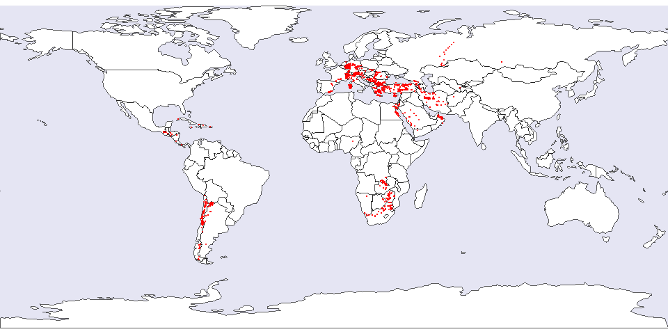

Thanks to the efforts of [Braden Cordivari](../team.qmd#braden-cordivari) and the [TerraLID Core Team](../team.qmd#core-team), GlobaLID now includes data for Cyprus, Anatolia, and the Caucasus, adding another 614 data points to the database. This update closes a major gap in the coverage of the Eastern Mediterranean and increases the number of data points in the data base to 6401. 

Check the News page of the [web application](https://globalid.dmt-lb.de/) to stay up-to-date to all major and minor updates. 

